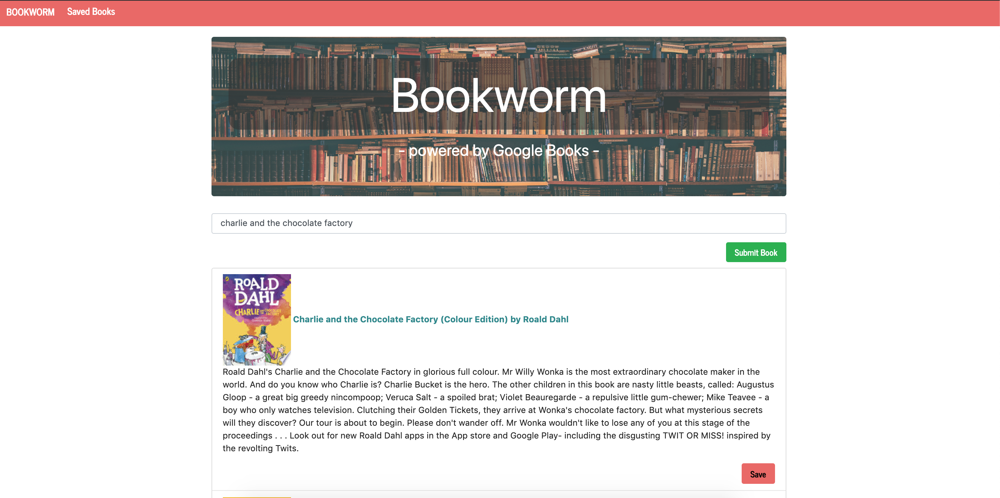
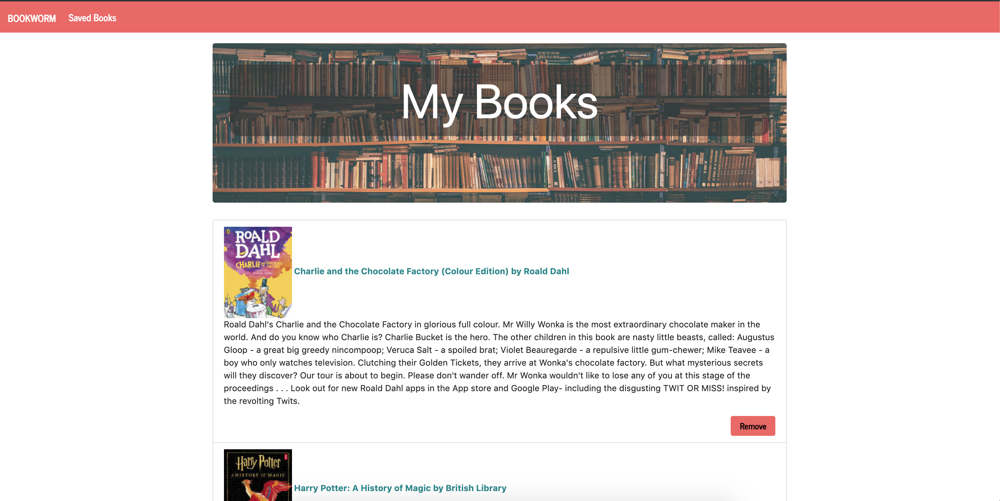

# BOOKWORM 

Author: Megha Bindiganavale

This is full-stack MERN application that allows users to search for books through the Google Books API and save favorite books to their page. 

Tech used: 

    - Node.js
    - React 
    - Express
    - MongoDB
    - Javascript 
    - Materialize 

Images: 

